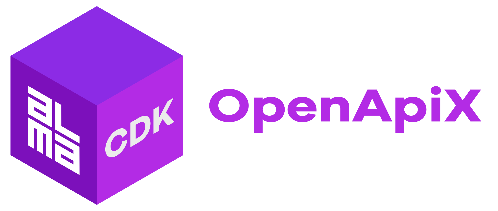
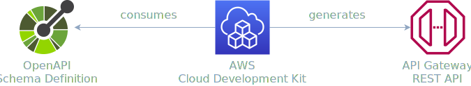

<div align="center">
	<br/>
	<br/>
  <h1>
	
  <br/>
  <br/>
  </h1>

  ```sh
  npm i -D @alma-cdk/openapix
  ```

  <div align="left">

  Generate AWS Api Gateway REST APIs via [OpenAPI](https://www.openapis.org/) (a.k.a. Swagger) Schema Definitions by consuming "clean" OpenAPI schemas and inject `x-amazon-apigateway-` extensions _with type-safety_.

  </div>
  <br/>
</div>


<br/>

<div align="center">



</div>

<br/>

## 🚧 &nbsp; Project Stability


This construct is still versioned with `v0` major version and breaking changes might be introduced if necessary (without a major version bump), though we aim to keep the API as stable as possible (even within `v0` development). We aim to publish `v1.0.0` soon and after that breaking changes will be introduced via major version bumps.

There are also some incomplete or buggy features, such as `AwsIntegration`, `MockIntegration` and `CognitoUserPoolsAuthorizer`.


<br/>

## Getting Started

1. Install `npm i -D @alma-cdk/openapix`

2. Define your API OpenApi Schema Definition in a `.yaml` file<br/>_without_ any `x-amazon-apigateway-` extensions

3. Use `openapix` constructs in CDK to consume the `.yaml` file and then assign API Gateway integrations using CDK


<br/>

## Lambda Integration

Given the following [`hello-api.yaml` OpenApi schema definition](https://github.com/alma-cdk/openapix/blob/main/examples/hello-api/schema/hello-api.yaml), _without_ any AWS API Gateway OpenApi extensions:
```yaml
openapi: 3.0.3
info:
  title: Hello API
  description: Defines an example “Hello World” API
  version: "0.0.1"
paths:
  "/":
    get:
      operationId: sayHello
      summary: Say Hello
      description: Prints out a greeting
      parameters:
      - name: name
        in: query
        required: false
        schema:
          type: string
          default: "World"
```

You may then define API Gateway AWS Lambda integration (within your stack):
```ts
const greetFn = new NodejsFunction(this, 'greet');

new openapix.Api(this, 'HelloApi', {
  source: path.join(__dirname, '../schema/hello-api.yaml'),
  paths: {
    '/': {
      get: new openapix.LambdaIntegration(this, greetFn),
    },
  },
})
```

See [`/examples/hello-api`](https://github.com/alma-cdk/openapix/tree/main/examples/hello-api) for full OpenApi definition (with response models) and an example within a CDK application.


<br/>

## HTTP Integration

Given the following [`http-proxy.yaml` OpenApi schema definition](https://github.com/alma-cdk/openapix/blob/main/examples/http-proxy/schema/http-proxy.yaml), _without_ any AWS API Gateway OpenApi extensions:
```yaml
openapi: 3.0.3
info:
  title: HTTP Proxy
  description: Proxies requests to example.com
  version: "0.0.1"
paths:
  "/":
    get:
      summary: proxy
      description: Proxies example.com
```

You may then define API Gateway HTTP integration (within your stack):
```ts
new openapix.Api(this, 'MyApi', {
  source: './schema.yaml',
  paths: {
    '/': {
      any: new openapix.HttpIntegration(this, "https://example.com"),
    },
  },
})
```

See [`/examples/http-proxy`](https://github.com/alma-cdk/openapix/tree/main/examples/http-proxy) for full OpenApi definition (with response models) and an example within a CDK application.


<br/>

## AWS Service Integration

Given [`books-api.yaml` OpenApi schema definition](https://github.com/alma-cdk/openapix/blob/main/examples/books-api/schema/books-api.yaml), _without_ any AWS API Gateway OpenApi extensions:

```ts
new openapix.Api(this, 'BooksApi', {
  source: path.join(__dirname, '../schema/books-api.yaml'),
  paths: {
    '/': {
      get: new openapix.AwsIntegration(this, {
        service: 'dynamodb',
        action: 'Scan',
        options: {
          credentialsRole: role, // role must have access to DynamoDB table
          requestTemplates: {
            'application/json': JSON.stringify({
              TableName: table.tableName,
            }),
          },
          integrationResponses: [
            {
              statusCode: '200',
              responseTemplates: {
                // See /examples/http-proxy/list-books.vtl
                'application/json': readFileSync(__dirname+'/list-books.vtl', 'utf-8'),
              },
            }
          ],
        },
      }),
    },
    '/{isbn}': {
      get: new openapix.AwsIntegration(this, {
        service: 'dynamodb',
        action: 'GetItem',
        options: {
          credentialsRole: role, // role must have access to DynamoDB table
          requestTemplates: {
            'application/json': JSON.stringify({
              TableName: table.tableName,
              Key: {
                item: {
                  "S": "$input.params('isbn')"
                }
              }
            }),
          },
          integrationResponses: [
            {
              statusCode: '200',
              responseTemplates: {
                // See /examples/http-proxy/get-book.vtl
                'application/json': readFileSync(__dirname+'/get-book.vtl', 'utf-8'),
              },
            }
          ],
        },
      }),
    },
  },
});
```

<br/>

## Mock Integration

🚧 Work-in-Progress

There is `new openapix.MockIntegration`, but it still has some problems.

<br/>

## Validators

API Gateway REST APIs can perform [request parameter and request body validation](https://docs.aws.amazon.com/apigateway/latest/developerguide/api-gateway-method-request-validation.html). You can provide both default validator and integration specific validator (which will override the default for given integration).

See [`/examples/todo-api`](https://github.com/alma-cdk/openapix/tree/main/examples/todo-api) for complete example within a CDK application.

Given [`todo-api.yaml` OpenApi schema definition](https://github.com/alma-cdk/openapix/blob/main/examples/todo-api/schema/todo-api.yaml) you may define the API Gateway validators for your integration in CDK:
```ts
new openapix.Api(this, 'MyApi', {
  source: path.join(__dirname, '../schema/todo-api.yaml'),

  validators: {
    'all': {
      validateRequestBody: true,
      validateRequestParameters: true,
      default: true, // set this as the "API level" default validator (there can be only one)
    },
    'params-only' : {
      validateRequestBody: false,
      validateRequestParameters: true,
    },
  },

  paths: {
    '/todos': {
      // this one uses the default 'all' validator
      post:  new openapix.HttpIntegration(this, baseUrl, { httpMethod: 'post' }),
    },
    '/todos/{todoId}': {
      // this one has validator override and uses 'params-only' validator
      get: new openapix.HttpIntegration(this, `${baseUrl}/{todoId}`, {
        validator: 'params-only',
        options: {
          requestParameters: {
            'integration.request.path.todoId': 'method.request.path.todoId',
          },
        },
      }),
    },
  },
})
```

<br/>

## Authorizers

🚧 Work-in-Progress

There are multiple ways to [control & manages access to API Gateway REST APIs](https://docs.aws.amazon.com/apigateway/latest/developerguide/apigateway-control-access-to-api.html) such as [resource policies](https://docs.aws.amazon.com/apigateway/latest/developerguide/apigateway-resource-policies.html), [IAM permissions](https://docs.aws.amazon.com/apigateway/latest/developerguide/permissions.html) and [usage plans with API keys](https://docs.aws.amazon.com/apigateway/latest/developerguide/api-gateway-api-usage-plans.html) but this section focuses on [Cognito User Pools ](https://docs.aws.amazon.com/apigateway/latest/developerguide/apigateway-integrate-with-cognito.html) and [Lambda authorizers](https://docs.aws.amazon.com/apigateway/latest/developerguide/apigateway-use-lambda-authorizer.html).

<br/>

### Cognito Authorizers

In this example we're defining a Congito User Pool based authorizer.

Given the following `schema.yaml` OpenApi definition:
```yaml
openapi: 3.0.1
paths:
  /:
    get:
      security:
        - MyAuthorizer: ["test/read"] # add scope
components:
  securitySchemes:
    MyCognitoAuthorizer:
      type: apiKey
      name: Authorization
      in: header
```

You can define the Cognito Authorizer in CDK with:
```ts
const userPool: cognito.IUserPool;

new openapix.Api(this, 'MyApi', {
  source: './schema.yaml',

  authorizers: [
    new openapix.CognitoUserPoolsAuthorizer(this, 'MyCognitoAuthorizer', {
      cognitoUserPools: [userPool],
      resultsCacheTtl: Duration.minutes(5),
    })
  ],
})
```

<br/>

### Lambda Authorizers

In this example we're defining a custom Lambda authorizer. The authorizer function code is not relevant for the example but the idea in the example is that an API caller sends some "secret code" in query parameters (`?code=example123456`) which then the authorizer function somehow evaluates.

Given the following `schema.yaml` OpenApi definition:
```yaml
openapi: 3.0.1
paths:
  /:
    get:
      security:
        - MyAuthorizer: [] # note the empty array
components:
  securitySchemes:
    MyCustomAuthorizer:
      type: apiKey
      name: code
      in: query
```

You can define the custom Lambda Authorizer in CDK with:
```ts
const authFn: lambda.IFunction;

new openapix.Api(this, 'MyApi', {
  source: './schema.yaml',

  authorizers: [

    new openapix.LambdaAuthorizer(this, 'MyCustomAuthorizer', {
      fn: authFn,
      identitySource: apigateway.IdentitySource.queryString('code'),
      type: 'request',
      authType: 'custom',
      resultsCacheTtl: Duration.minutes(5),
    }),
  ],


})
```


<br/>

## Inject/Reject

You may modify the generated OpenAPI definition (which is used to define API Gateway REST API) by injecting or rejecting values from the source OpenAPI schema definition:
```ts
new openapix.Api(this, 'MyApi', {
  source: './schema.yaml',

  // Add any OpenAPI v3 data.
  // Can be useful for passing values from CDK code.
  // See https://swagger.io/specification/
  injections: {
    "info.title": "FancyPantsAPI"
  },

  // Reject fields by absolute object path from generated definition
  rejections: ['info.description'],

  // Reject all matching fields from generated definition
  rejectionsDeep: ['example', 'examples'],
});
```

<br/>

## CORS

🚧 Work-in-Progress

Using `openapix.CorsIntegration` creates a Mock integration which responds with correct response headers:

```ts
new openapix.Api(this, 'MyApi', {
  source: './schema.yaml',

  paths: {
    '/foo': {
      options: new openapix.CorsIntegration(this, {
        // using helper method to define explicit values:
        headers: CorsHeaders.from(this, 'Content-Type', 'X-Amz-Date', 'Authorization'),
        origins: CorsOrigins.from(this, 'https://www.example.com'),
        methods: CorsMethods.from(this, 'options','post','get'),
      }),
    },
    '/bar': {
      options: new openapix.CorsIntegration(this, {
        // using regular string values:
        headers: 'Content-Type,X-Amz-Date,Authorization',
        origins: '*',
        methods: 'options,get',
      }),
    },
    '/baz': {
      options: new openapix.CorsIntegration(this, {
        // using helper constant for wildcard values:
        headers: CorsHeaders.ANY,
        origins: CorsOrigins.ANY,
        methods: CorsMethods.ANY,
      }),
    },
  },
});
```

When specifying multiple `origins` the mock integration uses [VTL magic](https://medium.com/@srikanth650/use-api-gateway-with-mock-integration-to-allow-cors-from-multiple-origins-bdcb431d07d3) to respond with the correct `Access-Control-Allow-Origin` header.

### Default CORS

If you wish to define same CORS options to every path, you may do so by providing a default `cors` value:
```ts
new openapix.Api(this, 'MyApi', {
  source: './schema.yaml',

  defaultCors: new openapix.CorsIntegration(this, {
    headers: CorsHeaders.ANY,
    origins: CorsOrigins.ANY,
    methods: CorsMethods.ANY,
  }),

  paths: {/*...*/},
});
```

This will apply the given `cors` configuration to _every_ path as `options` method. You may still do path specific overrides by adding an `options` method to specific paths.

<br/>

## API Gateway EndpointType

AWS CDK API Gateway constructs default to [_Edge-optimized API endpoints_](https://docs.aws.amazon.com/apigateway/latest/developerguide/api-gateway-api-endpoint-types.html#api-gateway-api-endpoint-types-edge-optimized) by using [`EndpointType.EDGE`](https://docs.aws.amazon.com/cdk/api/v2/docs/aws-cdk-lib.aws_apigateway.RestApi.html#endpointtypes) as the default.

This construct `@alma-cdk/openapix` instead defaults to using [_Regional API endpoints_](https://docs.aws.amazon.com/apigateway/latest/developerguide/api-gateway-api-endpoint-types.html#api-gateway-api-endpoint-types-regional) by setting `EndpointType.REGIONAL` as the default value. This is because we believe that in most cases you're better of by configuring your own CloudFront distribution in front the API. If you do that, you might also be interested in [`@alma-cdk/origin-verify` construct](https://github.com/alma-cdk/origin-verify).

You MAY override this default in `@alma-cdk/openapix` by providing your preferred endpoint types via `restApiProps`:
```ts
new openapix.Api(this, 'MyApi', {
  source: './schema.yaml',

  paths: {/*...*/},

  restApiProps: {
    endpointConfiguration: {
      types: [ apigateway.EndpointType.EDGE ],
    },
  },
});
```


